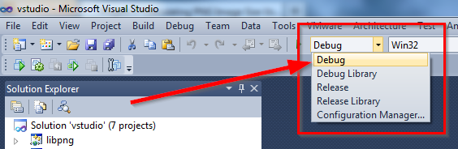

Project 7: Calculating PNG Image Size Using libpng
==================================================

Introduction
------------

In this project you will "fill in the blanks" of a function
that uses the open-source PNG image library "libpng"
to determine the height and width of a PNG image.
This function is fully robust and handles all errors.

You will need to use all knowledge learned up to this point
in order to complete this project,
along with some new things that will be introduced,
such as raising exceptions, memory management, and using third-party DLLs.

Here are some sample good and bad PNG files to play around with:

  - :download:`test.png <../test.png>`
  - :download:`test_bad1.png <../test_bad1.png>`
  - :download:`test_bad2.png <../test_bad2.png>`
  - :download:`test_bad3.png <../test_bad3.png>`
  - :download:`test_bad4.png <../test_bad4.png>`

Compile libpng
--------------

In this step you will compile libpng for yourself.

  1. Download the source code for the latest version of libpng
     (which at the time of writing is 1.6.6)
     from http://libpng.org/pub/png/libpng.html.
  2. Extract the downloaded file
     (in my case ``lpng166.zip``)
     somewhere on your computer.
  3. Open ``projects\vstudio\vstudio.sln`` in Visual Studio 2010
  4. In the drop-down listbox at the top of the screen
     change "Release" to "Debug Library"
     (see screenshot below)
  5. Press F7 to compile libpng; this should take less than 5 minutes

If successful, the file ``projects\vstudio\Debug\libpng16.dll``
will have been created.

png_dimensions() Function Skeleton
----------------------------------

Below is an implementation of a Python C extension function
that reads the width and height (in pixels) of a PNG image.
However, there are lots of "holes" in it
that you will be implementing in the following sections.

For now, copy and paste this code into the C source file
for your extension module (eg. ``denver.c``):

.. code-block:: c

    #include <png.h>

    // denver_png_read_fn() is invoked by libpng to read chunks of bytes from the file;
    // if a read error occurs then an IOError is raised;
    // if the end-of-file is reached prematurely then IOError is raised;
    // after raising the error, jumps to the error handler
    static void
    denver_png_read_fn(
        png_structp png_ptr,
        png_bytep data,
        png_size_t length
    ) {
        FILE *f;
        png_size_t n;
        f = (FILE*) png_get_io_ptr(png_ptr);

        n = fread(data, 1, length, f);

        // if fread() returns fewer bytes than expected, it is either due to an
        // error or premature end-of-file; in either case, raise IOError
        if (n < length) {
            if (ferror(f)) {
                // TODO 2C: raise IOError from errno
                // do NOT return NULL after setting the exception;
                // instead, use the longjmp call below to exit this method
            } else {
                // TODO 3B: raise IOError due to premature end-of-file
            }

            // jump to the setjmp() call in denver_png_dimensions() to
            // return control to the Python interpreter with the IOError raised
            png_longjmp(png_ptr, 1);
        }
    }

    // denver_png_error_fn() is invoked by libpng when an error occurs;
    // this function raises a Python ValueError with the given message
    // then jumps to the error handler
    static void
    denver_png_error_fn(
        png_structp png_ptr,
        png_const_charp message
    ) {
        // raise a Python ValueError exception with the given message
        // TODO 3C: raise ValueError with the given message

        // jump to the setjmp() call in denver_png_dimensions() to
        // return control to the Python interpreter with the IOError raised
        png_longjmp(png_ptr, 1);
    }

    static PyObject *
    denver_png_dimensions(
        PyObject *module,
        PyObject *args
    ) {
        FILE *f;
        char *path;
        size_t n;
        char buf[8];
        int isPng;
        png_structp png_ptr = NULL;
        png_inforp info_ptr = NULL;
        png_uint_32 image_width, image_height;
        PyObject *retval, *widthObj, *heightObj;

        // TODO 1: replace the hardcoded path with an argument to the function (hint: PyArg_ParseTuple)
        path = "test.png";

        // open the file for reading in binary mode;
        // fopen() returns NULL and sets errno if opening fails;
        // raise IOError if fopen() failed
        f = fopen(path, "rb");
        if (!f) {
            // TODO 2A: raise IOError exception from errno
            Py_RETURN_NONE;
        }

        // read the PNG signature (8 bytes) from the file;
        // if less than 8 bytes is returned then either a read error occurred
        // and errno was set or end-of-file was reached;
        // if an error occurred then raise IOError;
        // otherwise, let it fail later on when the PNG signature is validated
        n = fread(buf, 1, 8, f);
        if (n < 8 && ferror(f)) {
            // TODO 2B: raise IOError exception from errno
            fclose(f);
            Py_RETURN_NONE;
        }

        // verify the PNG signature; raise ValueError if the verification fails
        isPng = png_check_sig(buf, n);
        if (! isPng) {
            fclose(f);
            // TODO 3A: raise ValueError exception since PNG header is invalid
            Py_RETURN_NONE;
        }

        png_ptr = png_create_read_struct(
            PNG_LIBPNG_VER_STRING, NULL, NULL, NULL);
        if (! png_ptr) {
            fclose(f);
            // TODO 4A: out of memory; raise exception using the special "no memory" function
            Py_RETURN_NONE;
        }

        info_ptr = png_create_info_struct(png_ptr);
        if (! info_ptr) {
            png_destroy_read_struct(&png_ptr, NULL, NULL);
            fclose(f);
            // TODO 4B: out of memory; raise exception using the special "no memory" function
            Py_RETURN_NONE;
        }

        // when an error occurs in libpng, this "if" statement will be executed;
        // setjmp/longjmp is the default error handling used by libpng
        if (setjmp(png_jmpbuf(png_ptr)) != 0) {
            png_destroy_read_struct(&png_ptr, &info_ptr, NULL);
            fclose(f);
            // TODO 2D: change to return NULL once error handling is implemented
            // in denver_png_read_fn and denver_png_error_fn
            Py_RETURN_NONE;
        }

        // read the PNG header and extract the image's width and height
        png_set_read_fn(png_ptr, f, denver_png_read_fn);
        png_set_error_fn(png_ptr, NULL, denver_png_error_fn, NULL);
        png_set_sig_bytes(png_ptr, n);
        png_read_info(png_ptr, info_ptr);
        image_width = png_get_image_width(png_ptr, info_ptr);
        image_height = png_get_image_height(png_ptr, info_ptr);
        png_destroy_read_struct(&png_ptr, &info_ptr, NULL);
        fclose(f);

        // create Python int objects from the width and height
        widthObj = PyInt_FromLong(image_width);
        // TODO 5: handle out-of-memory error

        heightObj = PyInt_FromLong(image_height);
        // TODO 6: handle out-of-memory error; make sure to use Py_DECREF
        // for any newly-created Python objects created above

        // TODO 7: create a tuple containing the width and heigh objects
        // and return it; remember to Py_DECREF any Python objects that were
        // created above when handling errors from creating the tuple
        Py_RETURN_NONE;
    }

Add png_dimensions() to Function Table
--------------------------------------

Just like with ``hello_world()`` and ``hello_you()``,
the ``png_dimensions()`` function needs to be added to the ``PyMethodDef``
function table.

See if you can figure out yourself how to add it.
If not, the line you need to add is below:

.. code-block:: c

    {"png_dimensions", denver_png_dimensions, METH_VARARGS, NULL},

Compile and Try It
------------------

Before you can compile the module with ``png_dimensions()``,
you need to update ``setup.py`` to tell it about libpng.
Specifically, you need to add the
``include_dirs``, ``library_dirs``, and ``libraries``
arguments to the ``distutils.core.Extension`` call:

.. code-block:: python

    ext_module = distutils.core.Extension(
        "denver",
        sources=["denver.c"],
        include_dirs=[r"c:\lpng166"],
        library_dirs=[r"c:\lpng166\projects\vstudio\Debug"],
        libraries=["libpng16"],
    )

You will need to adjust the ``include_dirs`` and ``library_dirs``
to match the directory into which you extracted the libpng source code.

With that done, you should now be able to compile your extension module:

.. code-block:: python

    python_d setup.py build_ext --debug --inplace

To *use* your extension module you will have to do one more thing:
add the directory specified as ``library_dirs`` to your PATH.
This tells Python where to find libpng16.dll at runtime.

.. code-block:: text

    set PATH=%PATH%;c:\lpng166\projects\vstudio\Debug

Finally, try and invoke ``png_dimensions()`` from your Python interpreter:

.. code-block:: text

    c:\dev\cpyextworkshop>set PATH=%PATH%;c:\lpng166\projects\vstudio\Debug
    c:\dev\cpyextworkshop>python_d
    Python 2.7.5 (default, Sep 23 2013, 20:55:44) [MSC v.1600 32 bit (Intel)] on win32
    Type "help", "copyright", "credits" or "license" for more information.

    >>> import denver
    [43244 refs]

    >>> denver.png_dimensions()
    [43246 refs]

Notice how ``png_dimensions()`` returned ``None``?
In the steps to follow, we will update it to return a (width, height) tuple.

If you see the following ImportError
make sure that the directory you added to the PATH environment variable above
contains libpng16.dll.
Also, try setting the PATH environment variable again,
as the change to the PATH will be lost if you start a new command prompt window.

.. code-block:: text

    Traceback (most recent call last):
      File "<stdin>", line 1, in <module>
    ImportError: DLL load failed: The specified module could not be found.

TODO 1: Parse the Function's Arguments
--------------------------------------

In the implementation above, the ``png_dimensions()`` function
*ignores* all arguments it is given and hardcodes the path of the PNG file as ``test.png``.
Modify the code at ``TODO 1`` to use
`PyArg_ParseTuple <http://docs.python.org/2/c-api/arg.html#PyArg_ParseTuple>`_
to parse the arguments.
The function's arguments are just a single string argument
whose value is the path of the PNG file whose dimensions to get and return.
Refer back to a previous project if you need a reminder of how to do this.

TODO 2: Raise IOError if opening the file fails
-----------------------------------------------

Something we haven't talked about yet is how to raise Python exceptions from C.
Since C does not natively support the concept of "exceptions"
you have to instead "set" an exception,
which will be raised in Python once the C function returns.
After setting an exception, you *MUST* return ``NULL``;
in fact, this is the *only* time that returning ``NULL``
from a C extension function is allowed.

The ``PyErr_`` family of functions are used to set a Python exception.
For example,

    - `PyErr_SetString <http://docs.python.org/2/c-api/exceptions.html?#PyErr_SetString>`_
    - `PyErr_Format <http://docs.python.org/2/c-api/exceptions.html?#PyErr_Format>`_
    - `PyErr_SetFromErrno <http://docs.python.org/2/c-api/exceptions.html?#PyErr_SetFromErrno>`_

The ``PyExc_`` family of ``PyObject*`` objects
define the built-in exception types.
For example,

    - ``PyExc_ValueError``
    - ``PyExc_IOError``
    - ``PyExc_TypeError``

See `<http://docs.python.org/2/c-api/exceptions.html?#standard-exceptions>`_ for details.

So to raise an IOError based on the current value of ``errno``, do this:

.. code-block:: c

    PyErr_SetFromErrno(PyExc_IOError);
    return NULL;

Make this change at the following markers
where an IOError should be raised based on ``errno``:

    - TODO 2A
    - TODO 2B
    - TODO 2C (note: do NOT return NULL immediately after raising the exception here)
    - TODO 2D (note: just change the return value to NULL instead of Py_RETURN_NONE

You should now be able to compile using ``setup.py``.
Try invoking ``png_dimensions()`` with a non-existing filename;
it should now raise ``IOError``.

TODO 3: Raise ValueError if PNG file contents are invalid
---------------------------------------------------------

It is, of course, also possible to raise arbitrary exceptions.
Use
`PyErr_SetString <http://docs.python.org/2/c-api/exceptions.html?#PyErr_SetString>`_:
for this purpose.

.. code-block:: c

    void PyErr_SetString(PyObject *type, const char *message)

For example, to raise a ``ValueError`` with the message ``"Invalid bytes"`` use:

.. code-block:: c

    PyErr_SetString(PyExc_ValueError, "Invalid bytes");
    return NULL;

Add the logic to raise a ValueError at the following markers:

    - TODO 3A
    - TODO 3B (note: raise IOError here instead of ValueError)
    - TODO 3C

As an advanced (and optional) improvement, add useful context information
to the error message, such as the actual number of bytes read, using
`PyErr_Format <http://docs.python.org/2/c-api/exceptions.html?#PyErr_Format>`_.

.. code-block:: c

    PyObject* PyErr_Format(PyObject *exception, const char *format, ...)

TODO 4: Raise OutOfMemoryError if memory is exhausted
-----------------------------------------------------

Although it doesn't happen often and is difficult to even test,
it is important that your application not crash in the face of memory exhaustion.
The normal symptom of memory being exhausted is that a function
that is supposed to create an object instead returns NULL.

In the code above, the calls to
``png_create_read_struct()`` and ``png_create_info_struct()``
return ``NULL`` if they run out of memory.
Python has a special function for raising an out-of-memory error:
`PyErr_NoMemory <http://docs.python.org/2/c-api/exceptions.html?#PyErr_NoMemory>`_.

.. code-block:: c

    PyObject* PyErr_NoMemory()

Here is an example:

.. code-block:: c

    char *name = (char *) malloc(sizeof(char) * 100);
    if (name == NULL) {
        PyErr_NoMemory();
        return NULL;
    }

Update the following markers to raise an out-of-memory error if memory is exhausted:

    - TODO 4A
    - TODO 4B

TODO 5: Create Python int for image width
-----------------------------------------

You can see at the "TODO 5" marker in the source code above that it uses
`PyInt_FromLong <http://docs.python.org/2/c-api/int.html#PyInt_FromLong>`_
to convert the image width into a Python int object.
Since ``PyInt_FromLong()`` creates a *new* object
it has the potential of running out of memory and returning ``None``.
But one nice aspect of ``PyInt_FromLong()``
(and most other functions in the Python API)
is that it looks after setting the exception for you.
So if ``PyInt_FromLong()`` returns ``NULL``,
all you have to do is check for it and return ``NULL`` if it happens.

So edit the code at TODO 5 to check for a ``NULL`` return value
from ``PyInt_FromLong()`` and return ``NULL`` if that happens.

TODO 6: Create Python int for image height
------------------------------------------

The code above also needs to check for a ``NULL`` return value
from ``PyInt_FromLong()`` when converting the *height* to a Python int.
But there is one difference here, and it has to do with memory management.

When you are writing pure Python code you can create objects and then forget about them.
The Python interpreter automatically looks after releasing the memory occupied by objects
that are no longer in use.
However, when writing C extension modules, you have to look after this yourself.

Python uses a "reference counting" scheme to keep track of the number of references
to an object.
Once the reference count drops to zero, the object is deleted.
To explicitly decrement the reference count of a Python object, use
`Py_DECREF <http://docs.python.org/2/c-api/refcounting.html?#Py_DECREF>`_

So now suppose that ``PyInt_FromLong()`` returns ``NULL``
when creating a Python object for the height.
Just before that we also used ``PyInt_FromLong()`` to create a Python object
for the width.
If we are going to exit the function prematurely due to ``PyInt_FromLong()`` failing
we need to explicitly Py_DECREF the width object;
otherwise it will never be garbage collected and constitutes a memory leak.

So here is how to properly handle errors when creating the height object:

.. code-block:: c

    heightObj = PyInt_FromLong(image_height);
    if (heightObj == NULL) {
        Py_DECREF(widthObj);
        return NULL;
    }

Make this change to the code at the TODO 6 marker.

TODO 7: Create the tuple and return it
--------------------------------------

The final piece to the puzzle is creating the ``(width, height)`` tuple and returning it.
Use
`PyTuple_New <http://docs.python.org/2/c-api/tuple.html?#PyTuple_New>`_
to create a new, empty tuple:

.. code-block:: c

    PyObject* PyTuple_New(Py_ssize_t len)

Then use
`PyTuple_SET_ITEM <http://docs.python.org/2/c-api/tuple.html?#PyTuple_SET_ITEM>`_
to set the value of each element of the tuple:

.. code-block:: c

    void PyTuple_SET_ITEM(PyObject *p, Py_ssize_t pos, PyObject *o)

Note that it is an error to return a tuple to Python
that has *not* had all of its elements initialized.
When you set an element of a tuple,
the tuple "steals" the reference, so that you do *not* need to Py_DECREF it.

Here is an example of creating the tuple ``(5, None)``

.. code-block:: c

    PyObject *intValue, *tupleObj;
    intValue = PyInt_FromLong(5);
    if (intValue == NULL) {
        return NULL;
    }
    tupleObj = PyTuple_New(2);
    if (tupleObj == NULL) {
        Py_DECREF(intValue);
        return NULL;
    }
    Py_INCREF(Py_None);
    PyTuple_SET_ITEM(tupleObj, 0, intValue);
    PyTuple_SET_ITEM(tupleObj, 1, Py_None);
    return tupleObj;

Edit the code at the TODO 7 marker to create the (width, height) tuple and return it.
Make sure to perform the necessary Py_DECREF operations if creating the tuple fails.

BONUS 1: Use Py_BuildValue to create the tuple
----------------------------------------------

There is actually an easier way to create the tuple:
`Py_BuildValue <http://docs.python.org/2/c-api/arg.html?#Py_BuildValue>`_.

Change the code that creates the (width, height) tuple to use ``Py_BuildValue()``.

BONUS 2: Release the GIL when calling fopen and fread
-----------------------------------------------------

As mentioned in a previous project,
it is desirable to release the Global Interpreter Lock
when performing potentially-long-running IO operations.
In this code, the calls to ``fopen()`` and ``fread()``
are just such functions,
especially if they are operating on files over a network.

Add code to release the GIL when calling fopen() and fread().

SOLUTION
--------

Here is a complete solution that you can refer to if you need:
:download:`denver.c <../denver.c>`.
